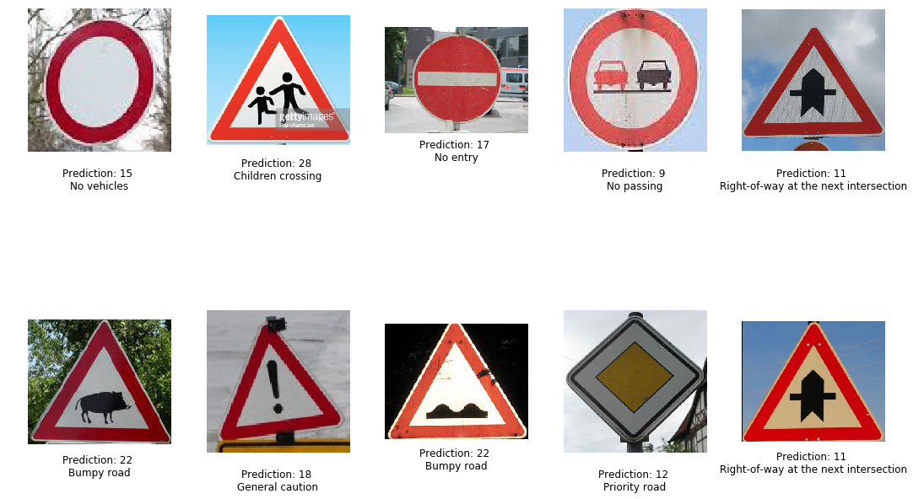

# **Traffic Sign Detection** 

Overview
---

This project uses deep neural networks and convolutional neural networks to classify traffic signs from the German Traffic Sign Dataset. I utilized a modified LeNet architecture for this purpose.

The project consists of a few key files/folders which describe the project in detail:
1. A file containing project code ([Traffic_Sign_Classifier_Dropout.ipynb](https://github.com/iammsg/Project3/blob/master/Traffic_Sign_Classifier_Dropout.ipynb)): This python notebook details the steps undertaken to explore and preprocess the data, construct a neural network and train it. The notebook also allows for the validation and testing of the model.
2. A file containing project code in HTML format([Traffic_Sign_Classifier_Dropout.html](https://github.com/iammsg/Project3/blob/master/Traffic_Sign_Classifier_Dropout.html)
3. A writeup that decribes the solution ([Writeup.md](https://github.com/iammsg/Project3/blob/master/Writeup.md)): This markdown file describes the network in detai and identifies some of the steps taken to train and test the model.

These were created in accordance to the [project rubric](https://review.udacity.com/#!/rubrics/1970/view)
